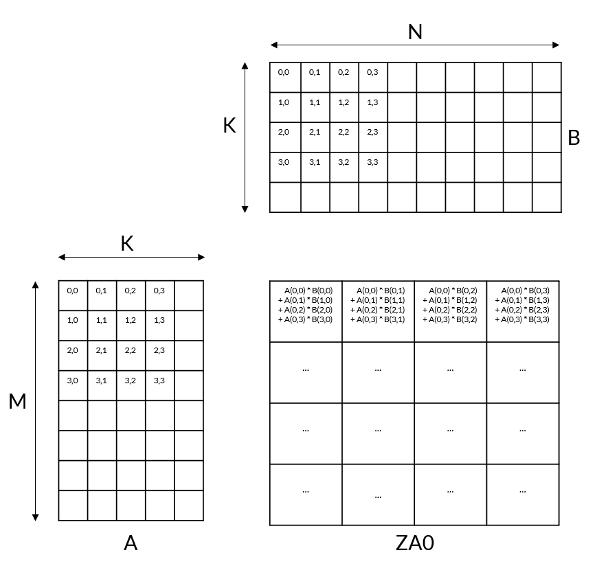

# Overview of the matmul_int8 algorithm

The matmul_int8 example uses the fact that multiplying two matrices together is the same as summing the outer products for each column of matLeft and each row of matRight in turn, just like the matmul_fp32 example. The code uses the four-way sum of outer products and accumulate umopa instruction to multiply the 8-bit matLeft and matRight matrices and produce the 32-bit result matrix matResult_opt.

The umopa instruction shows how the umopa instruction accumulates four 8-bit outer-products into a single 32-bit container:

Figure 1. The umopa instruction

<p align="center">
  
</p>

For example, consider a matrix multiplication C = A x B, with M = 7, K = 6, and N = 5. The first umopa instruction sums four consecutive multiplications over the K dimension in a single instruction, as follows:


ZA0.s[0][0] += A(0,0)*B(0,0)  +  A(0,1)*B(1,0)  +  A(0,2)*B(2,0)  +  A(0,3)*B(3,0)
ZA0.s[0][1] += A(0,0)*B(0,1)  +  A(0,1)*B(1,1)  +  A(0,2)*B(2,1)  +  A(0,3)*B(3,1)
ZA0.s[0][2] += A(0,0)*B(0,2)  +  A(0,1)*B(1,2)  +  A(0,2)*B(2,2)  +  A(0,3)*B(3,2)
ZA0.s[0][3] += A(0,0)*B(0,3)  +  A(0,1)*B(1,3)  +  A(0,2)*B(2,3)  +  A(0,3)*B(3,3)

These 32-bit results are then stored in the first horizontal slice of the ZA0 tile.

> Note:  This specific example assumes that the hardware implementation uses a 128-bit SVL, which gives an SVLs of 4. This means that each row in the ZA tile can contain four 32-bit values. Implementations that use a bigger SVL have bigger ZA tiles containing more results.

This widening umopa instruction requires matrix data to be prepared in advance. Specifically, matrices must be padded with zeros. During re-arrangement the output matrices are allocated with a modified K equal to K_mod = K*ceil(K/4), that is a multiple of four. This avoids calculation errors that would result from using unknown values outside the matrix bounds.

The initial input matrices are stored in memory as row-major arrays. Matrix multiplication is performed as the sum of the outer product of one column from matLeft and one row from matRight.

The code rearranges data in both the matLeft and matRight matrices. This rearrangement is required because:

- A left matrix transposition is needed to implement a matrix multiplication with outer-products. This example uses a per-block matrix transposition.
- Four-way interleaving is required because the four-way umopa instruction performs the sum of four outer-products and accumulates the results.

The implementation therefore has the following steps:

1. Rearrange the matRight matrix, using the function preprocess_r.
Row elements from the matRight matrix are four-way interleaved and contiguously stored to memory in blocks of 2 x SVLs columns. Each matrix row is zero-padded to 2 * SVLs elements. The final block of matrix columns is zero-padded to a multiple of 4 rows, if required. This rearranged data is called matRight_mod.
2. Rearrange the matLeft matrix, using the function preprocess_l.
Elements from the matLeft matrix transpose-like re-arranged and contiguously stored to memory in blocks of SVLs rows x SVLs columns. Each block of SVLs rows is 32-bit width transposed and contiguously stored to memory. Each 32-bit container of the re-arranged matrix contains elements from 4 consecutive columns. This rearranged data is called matLeft_mod.
3. Multiply the rearranged matLeft_mod and matRight_mod matrices using the outer product instruction in the function matmul_opt.
This function contains three nested loops:
    a. The outermost loops iterates over the rows (M) of the result matrix.
    b. The middle loop iterates over the columns (N) of the result matrix.
    c. The innermost loop iterates over the K dimension, producing result matrix elements as a sum of products.

The following sections describe these operations in more detail.

## preprocess_r code

```assembly
1.  preprocess_r:  // x0: K, x1: N, x2: matRight, x3: matRight_mod
2.      smstart sm              // Enable Streaming mode
3. 
4.  // constants
5.      cntb    x5
6.      lsl     x16, x1, #1     // 2*ldb
7.      add     x10, x16, x1    // 3*ldb
8.      add     x4, x0, #3
9.      lsr     x4, x4, #2      // nbr_mod/4 = ceil(nbr/4)
10.     mul     x11, x4, x5     // (nbr_mod/4)*SVLb
11.     lsl     x17, x11, #1    // 2*(nbr_mod/4)*SVLb
12.     mov     x15, #0         // psel variable
13.     cnth    x13             // SVLb/2
14. 
15.     ptrue   pn9.b
16. 
17.     add     x8, x2, x1      // N dimension exit condition
18.     whilelt p2.b, x2, x8    // N dimension predicate
19. 
20. .Loop_N:
21.     mov     x7, x2          // b_ptr
22.     mov     x9, x3          // b_mod_ptr
23.     whilelt p1.b, xzr, x0   // K dimension predicate
24. 
25.     // Store predicates
26.     psel    pn11, pn9, p2.b[w15, 0]
27.     psel    pn12, pn9, p2.b[w13, 0]
28. 
29.     mov     x6, xzr         // Loop_K counter
30. .Loop_K:
31.     psel    p0, p2, p1.b[w15, 0]
32.     psel    p3, p2, p1.b[w15, 1]
33.     ld1b    {z0.b}, p0/z, [x7]
34.     ld1b    {z1.b}, p3/z, [x7, x1]
35. 
36.     psel    p0, p2, p1.b[w15, 2]
37.     psel    p3, p2, p1.b[w15, 3]
38.     ld1b    {z2.b}, p0/z, [x7, x16]
39.     ld1b    {z3.b}, p3/z, [x7, x10]
40. 
41.     zip    { z8.b - z11.b }, { z0.b - z3.b } // 4-way interleave from 4 vectors
42. 
43.     st1b    { z8.b-z9.b }, pn11, [x9]        // b_mod_ptr
44.     st1b    { z10.b-z11.b }, pn12, [x9, x17] // b_mod_ptr + 2*(nbr_mod/4)*SVLb
45. 
46.     add     x7, x7, x1, lsl #2            // &b_ptr += 4*ldb
47.     addvl   x9, x9, #2                    // &b_mod_ptr += 2*SVLb
48.     add     x6, x6, #4                    // Loop_K counter increment
49.     whilelt p1.b, x6, x0                  // K dimension predicate
50.     b.first .Loop_K
51. 
52.     add     x3, x3, x17, lsl #1           // &b_mod += 4*ceil(nbr/4)*SVLb
53.     addvl   x2, x2, #1                    // &b_base += SVLb 
54.     whilelt p2.b, x2, x8                  // N dimension predicate
55.     b.first .Loop_N
56. 
57.     smstop sm                             // Disable Streaming mode
58. 
59.     ret
```

### preprocess_r function details

This section describes how the preprocess_r function operates, looking at sections of the code in turn.

- On entry, function arguments are passed in registers as follows:
  - x0: K, the number of rows in the matRight matrix
  - x1: N, the number of columns in the matRight matrix
  - x2: The base address of the input matrix, matRight
  - x3: The base address of the rearranged matrix, matRight_mod
- Lines 33-34 and 38-39
  The ld1b instructions load four vectors from four consecutive matrix rows.
- Line 41
  The four vectors are four-way interleaved by the four-vector zip SME2 instruction.
- Lines 43-44
  The two-vector st1b instructions store the resulting four vectors as follows:
    - The first 2 vectors are consecutively stored to the first rearranged block, pointed to by b_mod_ptr.
These vectors are consumed together first in matmul_opt for all K values, storing the first 2 x SVLs columns consecutively after rearrangement.
    - The second 2 vectors are consecutively stored to the second rearranged block. This block is at an offset of 2 x (K_mod / 4) x SVLb, which is equal to 2 x SVLs x K_mod (K_mod = ceil(K/4) * 4).
      These vectors are consumed by the next N dimension loop iteration in matmul_opt. This is why they are stored with an offset.

## preprocess_l code

```assembly
1.  preprocess_l:   // x0: M, x1: K, x2: matLeft, x3: matLeft_mod
2.    stp     x19, x20, [sp, #-32]!
3.  
4.    smstart                          // Enable Streaming mode & ZA
5. 
6.  // constants
7.    cntw    x5                       // SVLs
8.    mul     x11, x5, x1              // SVLs*nbc
9.    add     x25, x1, #3
10.   lsr     x25, x25, #2             // ceil(nbc/4)
11.   mul     x15, x25, x5             // SVLs*ceil(nbc/4)
12.   lsl     x25, x15, #2             // SVLs*ceil(nbc/4)*4
13. 
14.   mul     x4, x5, x5               // SVLs*SVLs
15.   lsl     x16, x4, #1              // 2*SVLs*SVLs
16.   add     x16, x16, x4             // 3*SVLs*SVLs
17.   cntb    x17                      // SVLb
18. 
19.   mov     x8, #0                   // Loop_M counter
20.   whilelt p0.s, x8, x0             // M dimension predicate
21. 
22. .Loop_M:
23.   mov     x7, x3                   // a_mod_base
24.   mov     x10, x2                  // a_base
25.   add     x9, x2, x1               // Loop_K exit condition
26.   whilelt pn12.b, x2, x9, vlx4     // K dimension predicate-as-counter
27.   mov     x13, #0                  // offset0=0
28.   mov     x14, x4                  // offset1=SVLs*SVLs
29.   lsl     x19, x4, #1              // offset2=2*SVLs*SVLs
30.   mov     x20, x16                 // offset3=3*SVLs*SVLs
31. 
32. .Loop_K:
33.   mov     x6, x10                  // a_ptr
34. 
35.   mov     w12, #0                  // Loop_load counter
36. .Loop_load:
37.   psel    pn8, pn12, p0.b[w12, #0]
38.   psel    pn9, pn12, p0.b[w12, #4]
39.   ld1b    {z0.b-z3.b}, pn8/z, [x6]      // Load 4 vectors from a_ptr
40.   ld1b    {z4.b-z7.b}, pn9/z, [x6, x1]  // Load 4 vectors from a_ptr + nbc
41.   mova    za0h.b[w12, 0:3], {z0.b-z3.b} // za0h.s, za1h.s, za2h.s, za3h.s: row 1
42.   mova    za0h.b[w12, 4:7], {z4.b-z7.b} // za0h.s, za1h.s, za2h.s, za3h.s: row 2
43.   add     w12, w12, #8                  // Loop_load counter increment
44.   add     x6, x6, x1, lsl #1            // a_ptr += 2*nbc INT8 elems 
45.   cmp     w12, w17
46.   b.mi    .Loop_load
47. 
48.   mov     w12, #0                         // Loop_store counter
49. .Loop_store:
50.   whilelt pn8.s, x13, x15, vlx4           // Tile0 store predicate-as-counter
51.   whilelt pn9.s, x14, x15, vlx4           // Tile1 store predicate-as-counter
52.   whilelt pn10.s, x19, x15, vlx4          // Tile2 store predicate-as-counter
53.   whilelt pn11.s, x20, x15, vlx4          // Tile3 store predicate-as-counter
54.   mova    {z0.s-z3.s}, za0v.s[w12, 0:3]
55.   mova    {z4.s-z7.s}, za1v.s[w12, 0:3]
56.   mova    {z8.s-z11.s}, za2v.s[w12, 0:3]
57.   mova    {z12.s-z15.s}, za3v.s[w12, 0:3]
58.   add     w12, w12, #4                        //Inc Loop_store counter
59.   st1w    {z0.s-z3.s},pn8,[x7, x13, lsl #2]   //1st 4 cols Tile0: a_mod+offset0
60.   st1w    {z4.s-z7.s},pn9,[x7, x14, lsl #2]   //1st 4 cols Tile1: a_mod+offset1
61.   st1w    {z8.s-z11.s},pn10,[x7, x19, lsl #2] //1st 4 cols Tile2: a_mod+offset2
62.   st1w    {z12.s-z15.s},pn11,[x7, x20, lsl #2]//1st 4 cols Tile3: a_mod+offset3
63.   incw    x13, all, mul #4           // Tile0 store pointer offset increment
64.   incw    x14, all, mul #4           // Tile1 store pointer offset increment
65.   incw    x19, all, mul #4           // Tile2 store pointer offset increment
66.   incw    x20, all, mul #4           // Tile3 store pointer offset increment
67.   cmp     w12, w5
68.   b.mi    .Loop_store
69. 
70.   add     x13, x13, x16         // Tile0 store pointer offset += 3*SVLs*SVLs
71.   add     x14, x14, x16         // Tile1 store pointer offset += 3*SVLs*SVLs
72.   add     x19, x19, x16         // Tile2 store pointer offset += 3*SVLs*SVLs
73.   add     x20, x20, x16         // Tile3 store pointer offset += 3*SVLs*SVLs
74.   addvl   x10, x10, #4          // a_base += 4*SVLb INT8 elems 
75.   whilelt pn12.b, x10, x9, vlx4 // K dimension predicate-as-counter
76.   b.first .Loop_K
77. 
78.   add     x2, x2, x11           // &a += SVLs*nbc INT8 elems
79.   add     x3, x3, x25           // &a_mod += SVLs*ceil(nbc/4)*4 INT8 elems
80. 
81.   incw    x8
82.   whilelt p0.s, x8, x0
83.   b.first .Loop_M
84. 
85.   smstop                         // Disable Streaming mode & ZA
86. 
87.   ldp     x19, x20, [sp], #32
88. 
89.   ret
```

### preprocess_l function details

This section describes how the preprocess_l function operates, looking at sections of the code in turn.

- On entry, function arguments are passed in registers as follows:
  - x0: M, the number of rows in the matLeft matrix
  - x1: K, the number of columns in the matLeft matrix
  - x2: The base address of the input matrix, matLeft
  - x3: The base address of the rearranged matrix, matLeft_mod
- Lines 39-40:
  Each 4-vector ld1b instruction loads four vectors from a single row of the input matrix data. Each block transposition uses four vector loads and four 32-bit ZA tiles.
- Lines 41-42:
  The mova instructions move the data from Z vectors to horizontal slices of 8-bit element ZA tiles, as follows:
```
mova    za0h.b[w12, 0:3], { z0.b-z3.b }

ZA0h.s[0] = ZA0h.b[0] = Z0
ZA1h.s[0] = ZA0h.b[1] = Z1
ZA2h.s[0] = ZA0h.b[2] = Z2
ZA3h.s[0] = ZA0h.b[3] = Z3
```
This code loads horizontal slices of 8-bit ZA tiles, but stores vertical slices of 32-bit ZA tiles. This leverages 4-vector length loads from memory and places them each in its own tile.
- Lines 49-68 (Store_loop)
  Store_loop stores elements from 32-bit ZA tiles to memory. Each iteration stores 4 vertical slices of a 32-bit ZA tile into consecutive memory locations, using predication to determine when the bounds of the array are exceeded.
  The whilelt instructions in lines 50-53 generate predicate-as-counters for four-vector consecutive stores. The vlx4 in these instructions is the vector length specifier, and indicates that the predicate can control four vectors. The predicates ensure that non-existent columns in the ZA tiles are not stored to memory, using the base address to calculate the store bounds for each of the ZA tiles.
  The mova instructions in lines 54-57 move four vertical 32-bit slices of ZA0-ZA3 to consecutive groups of Z vectors. The v suffix accesses the data in the ZA tile as columns, rearranging the matrix.
  The st1w instructions in lines 59-62 perform vector contiguous stores from the Z vectors to memory.

## matmul_opt code

```assembly
1.   matmul_opt:  
2.   // x0: M, x1: K, x2: N, x3: matLeft_mod, x4: matRight_mod, x5: matResult_opt
3.     stp     x19, x20, [sp, #-48]!
4.     stp     x21, x22, [sp, #16]
5.     str     x23, [sp, #32]
6. 
7.     smstart                         // Enable Streaming mode & ZA
8. 
9.   // constants
10.    cntb    x6                      // SVLb
11.    cntw    x15                     // SVLs
12.    lsl     x11, x2, #2             // 4*N
13.    mul     x21, x15, x2            // SVLs*ldc
14.    add     x25, x21, x2            // (SVLs+1)*ldc
15.    add     x7, x1, #3
16.    lsr     x7, x7, #2              // ceil(K/4)
17.    mul     x7, x7, x6              // ceil(K/4)*SVLb
18.    lsl     x0, x0, #2              // 4*M
19.    mov     x12, #0                 // Loop_M counter
20.    mov     x15, #0                 // psel variable
21.    sub     w6, w6, #8              // SVLb-8
22.    ptrue   pn10.b                  // Predicate for SME2 VLx2 (a_ptr loads)
23.    whilelt p2.b, x12, x0           // Tile 0/1 predicate (M dimension)
24. 
25.  .Loop_M:
26.    addvl   x12, x12, #1            // Loop_M counter increment
27.    whilelt p3.b, x12, x0           // Tile 2/3 predicate (M dimension)
28. 
29.    mov     x19, x4                 // b_base
30.    mov     x22, x5                 // c_base
31.    mov     x13, #0                 // Loop_N counter
32.    add     x10, x3, x7             // a_base + 4*ceil(K/4)*SVLs 
33.    add     x17, x3, x7             // matLeft row0 end address
34.    addvl   x9, x17, #-1            // Loop_K exit condition
35. 
36. 
37.  .Loop_N:
38.    mov     x8, x3                  // a_ptr = a_base
39.    mov     x20, x19                // b_ptr = b_base
40.    mov     x23, x22                // c_ptr = c_base
41. 
42.    pext    { p0.b, p1.b }, pn9[0]  // Tile 0/2 and tile 1/3 predicates
43. 
44.    zero    {za}
45. 
46.    ld1b    {z1.b}, p2/z, [x8]      // Load 1st vector from a_ptr
47. 
48.    whilelt pn10.b, x8, x17, vlx2     // K dimension predicate-as-counter
49.    ld1b    {z2.b-z3.b}, pn9/z, [x20] // Load 2 vectors from b_ptr
50. 
51.    umopa   za0.s, p2/m, p0/m, z1.b, z2.b  // ZA0 += 1st a_ptr OP 1st b_ptr
52.    ld1b    {z5.b}, p3/z, [x8, x7]  // Load 2nd vec from a_ptr+ceil(K/4)*SVLb
53.    addvl   x8, x8, #1              // a_ptr += SVLb 
54. 
55.  .Loop_K:
56.    umopa   za2.s, p3/m, p0/m, z5.b, z2.b // ZA2 += 2nd a_ptr OP 1st b_ptr
57.    umopa   za1.s, p2/m, p1/m, z1.b, z3.b // ZA1 += 1st a_ptr OP 2nd b_ptr
58.    psel    pn11, pn10, p3.s[w15, #0]
59.    ld1b    {z0.b-z1.b}, pn10/z, [x8]     // Load 2 vectors from a_ptr
60.    umopa   za3.s, p3/m, p1/m, z5.b, z3.b // ZA3 += 2nd a_ptr OP 2nd b_ptr
61.    ld1b    {z6.b-z7.b}, pn9/z, [x20, #2, mul vl] // 2 vecs from b_ptr+2*SVLb
62. 
63.    umopa   za0.s, p2/m, p0/m, z0.b, z6.b // ZA0 += 1st a_ptr OP 1st b_ptr
64.    ld1b   {z4.b-z5.b}, pn11/z, [x8, x7]  // 2 vecs from a_ptr+ceil(K/4)*SVLb
65. 
66.    umopa   za2.s, p3/m, p0/m, z4.b, z6.b // ZA2 += 2nd a_ptr OP 1st b_ptr
67.    addvl   x20, x20, #4                  // b_ptr += 4*SVLb 
68. 
69.    umopa   za1.s, p2/m, p1/m, z0.b, z7.b // ZA1 += 1st a_ptr OP 2nd b_ptr
70. 
71.    umopa   za3.s, p3/m, p1/m, z4.b, z7.b // ZA3 += 2nd a_ptr OP 2nd b_ptr
72.    ld1b    {z2.b-z3.b}, pn9/z, [x20]     // Load 2 vectors from b_ptr
73. 
74.    umopa   za0.s, p2/m, p0/m, z1.b, z2.b // ZA0 += 1st a_ptr OP 1st b_ptr
75.    addvl   x8, x8, #2                    // a_ptr += 2*SVLb 
76. 
77. 
78.    cmp     x8, x9
79.    b.mi    .Loop_K
80. 
81.    umopa   za2.s, p3/m, p0/m, z5.b, z2.b // ZA2 += 2nd a_ptr OP 1st b_ptr
82. 
83.    umopa   za1.s, p2/m, p1/m, z1.b, z3.b // ZA1 += 1st a_ptr OP 2nd b_ptr
84. 
85.    umopa   za3.s, p3/m, p1/m, z5.b, z3.b
86.    addvl   x20, x20, #2                  // b_ptr += 2*SVLb 
87. 
88.    cmp     x8, x10
89.    b.ge    .Ktail_end
90. 
91.  .Ktail_start:
92.    ld1b    {z1.b}, p2/z, [x8]
93. 
94.    ld1b    {z2.b-z3.b}, pn9/z, [x20]
95. 
96.    umopa   za0.s, p2/m, p0/m, z1.b, z2.b
97.    ld1b    {z14.b}, p3/z, [x8, x7]
98. 
99.    umopa   za2.s, p3/m, p0/m, z14.b, z2.b
100. 
101.   umopa   za1.s, p2/m, p1/m, z1.b, z3.b
102.   addvl   x20, x20, #2                  // b_ptr += 2*SVLb 
103. 
104.   umopa   za3.s, p3/m, p1/m, z14.b, z3.b
105. 
106. .Ktail_end:
107.   // store results
108.   mov     w14, #0                       // Loop_store_ZA counter
109.   psel    pn8, pn9, p2.b[w14, 0]
110.   psel    pn11, pn9, p3.b[w14, 0]
111. // ZA tiles to vecs: z0=za0h.s[0], z1= za1h.s[0], z2=za2h.s[0], z3=za3h.s[0]
112.   mova    { z0.b-z3.b }, za0h.b[w14, 0:3]
113.   st1w    { z0.s-z1.s }, pn8, [x23]               // Store to c_ptr
114.   st1w    { z2.s-z3.s }, pn11, [x23, x21, lsl #2] // Store to c_ptr+SVLs*ldc
115. .Loop_store_ZA:
116.   psel    pn8, pn9, p2.b[w14, 4]
117.   psel    pn11, pn9, p3.b[w14, 4]
118.   mova    { z0.b-z3.b }, za0h.b[w14, 4:7]
119.   st1w    { z0.s-z1.s }, pn8, [x23, x2, lsl #2]   // to c_ptr+ldc
120.   st1w    { z2.s-z3.s }, pn11, [x23, x25, lsl #2] // to c_ptr+(SVLs+1)*ldc
121. 
122.   add     x23, x23, x2, lsl #3          // c_ptr += 2*ldc INT32 elms 
123.   add     w14, w14, #8                  // Loop_store_ZA counter increment
124. 
125.   psel    pn8, pn9, p2.b[w14, 0]
126.   psel    pn11, pn9, p3.b[w14, 0]
127.   mova    { z0.b-z3.b }, za0h.b[w14, 0:3]
128.   st1w    { z0.s-z1.s }, pn8, [x23]               // Store to c_ptr
129.   st1w    { z2.s-z3.s }, pn11, [x23, x21, lsl #2] // Store to c_ptr+SVLs*ldc
130.   cmp     w14, w6
131.   b.mi    .Loop_store_ZA
132. 
133.   psel    pn8, pn9, p2.b[w14, 4]
134.   psel    pn11, pn9, p3.b[w14, 4]
135.   mova    { z0.b-z3.b }, za0h.b[w14, 4:7]
136.   st1w    { z0.s-z1.s }, pn8, [x23, x2, lsl #2]   // to c_ptr+ldc
137.   st1w    { z2.s-z3.s }, pn11, [x23, x25, lsl #2] // to c_ptr+(SVLs+1)*ldc
138. 
139.   addvl   x22, x22, #2            // &c_base += 2*SVLb 
140.   addvl   x13, x13, #2            // Loop_N counter increment
141.   whilelt pn9.b, x13, x11, vlx2   // Tiles predicate-as-counter (N dimension)
142.   add     x19, x19, x7, lsl #1    // &b_base += 2*SVLs*4*ceil(K/4) 
143.   b.first .Loop_N
144. 
145.   add     x3, x3, x7, lsl #1      // a_base += 2*SVLs*4*ceil(K/4) 
146.   add     x5, x5, x21, lsl #3     // c_base += 2*SVLs*ldc INT32 elms 
147.   addvl   x12, x12, #1            // Loop_M counter increment
148.   whilelt p2.b, x12, x0           // Tile 0/1 predicate (M dimension)
149.   b.first    .Loop_M
150. 
151.   smstop                          // Disable Streaming mode & ZA
152. 
153.   ldr     x23, [sp, #32]
154.   ldp     x21, x22, [sp, #16]
155.   ldp     x19, x20, [sp], #48
156. 
157.   ret
```

### matmul_opt function overview

The matmul_opt function inner loop iterates over the rearranged columns of the matLeft matrix (matLeft_mod buffer) and rearranged rows of the matRight matrix (matRight_mod buffer). The outer products are calculated and stored in matResult_opt.

Results are accumulated into four 32-bit ZA tiles, with 2x2 tiling.

The matmul_opt function in this matmul_int8 example behaves in the same way as the matmul_fp32 example, but using umopa instructions rather than fmopa instructions.

See matmul_fp32 for details.